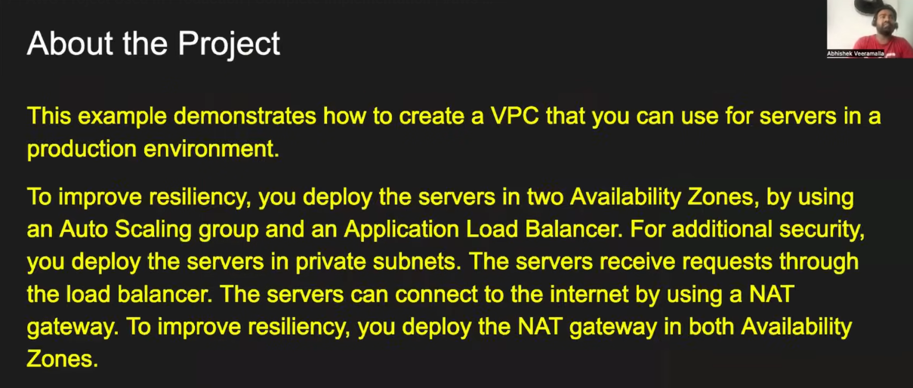
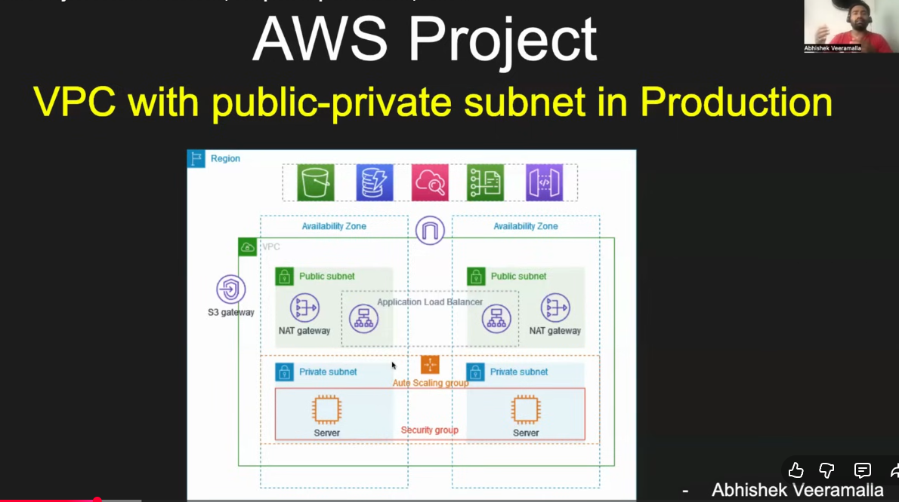

# AWS VPC Project: Production-Ready Multi-AZ Architecture

## Project Overview



This project demonstrates the creation of a **production-grade Virtual Private Cloud (VPC)** architecture designed for enterprise-level applications with high availability and security. The solution implements the following key objectives:

### Core Objectives:

1. **High Resiliency**: Deploy servers across **two Availability Zones (AZs)** to ensure fault tolerance and minimize downtime risk
2. **Auto Scaling**: Utilize **Auto Scaling Groups** to automatically manage EC2 instance capacity based on demand, ensuring optimal resource utilization
3. **Load Balancing**: Implement an **Application Load Balancer (ALB)** to distribute incoming traffic evenly across EC2 instances
4. **Enhanced Security**: House EC2 instances in **private subnets** to restrict direct internet access and isolate application servers
5. **Internet Connectivity**: Deploy **NAT (Network Address Translation) Gateways** in both AZs to enable outbound internet connectivity for instances in private subnets while maintaining security

### Why This Architecture?

- **Availability**: Multi-AZ deployment ensures instances continue running even if an entire AZ becomes unavailable
- **Scalability**: Auto Scaling Groups automatically adjust the number of running instances based on traffic patterns
- **Security**: Private subnets prevent instances from being directly accessible from the internet
- **Reliability**: NAT Gateways provide redundancy by being deployed in both AZs, preventing a single point of failure for outbound traffic

---

## Architecture Deep Dive



### Architecture Components:

The VPC architecture consists of the following layered structure:

#### **1. VPC Structure**

A single VPC spans across two Availability Zones (AZ-1 and AZ-2) with a properly segmented network design:

- **VPC Network**: Creates an isolated virtual network environment in AWS
- **Availability Zones**: Spreads infrastructure across geographically separate data centers within the same region for fault tolerance

#### **2. Public Subnets (2)**

Each Availability Zone contains one public subnet:

- **Purpose**: Hosts internet-facing resources
- **Components**:
  - **Internet Gateway (IGW)**: Enables communication between VPC resources and the internet
  - **NAT Gateway**: One NAT Gateway deployed in each public subnet
  - **Router/Route Table**: Directs traffic between subnets and the internet
  - **Application Load Balancer (ALB)**: Listens for incoming HTTP/HTTPS requests on port 80/443

**Why NAT Gateway in Public Subnet?**
- NAT Gateways must reside in public subnets to access the Internet Gateway
- Enables instances in private subnets to initiate outbound connections while preventing inbound unsolicited traffic
- Each AZ has its own NAT Gateway for high availability

#### **3. Private Subnets (2)**

Each Availability Zone contains one private subnet:

- **Purpose**: Hosts application servers securely
- **Components**:
  - **EC2 Instances**: Application servers that run the actual application
  - **Auto Scaling Group**: Automatically launches/terminates EC2 instances based on:
    - CPU utilization thresholds
    - Network I/O patterns
    - Custom metrics or schedules
  - **Route Table**: Directs outbound traffic through the NAT Gateway in the corresponding AZ

**Key Security Features:**
- No direct internet access (no Internet Gateway route)
- Instances can initiate outbound connections through NAT Gateway
- Inbound traffic only through ALB via target groups

#### **4. Traffic Flow Architecture**

##### **Inbound Traffic Flow (Client → Application):**

```
Client Request
    ↓
Internet Gateway
    ↓
Application Load Balancer (in Public Subnet)
    ↓
Target Groups (routes to EC2 instances)
    ↓
EC2 Instances in Private Subnets (AZ-1 & AZ-2)
    ↓
Application Response
    ↓
Client
```

##### **Outbound Traffic Flow (Application → Internet):**

```
EC2 Instance in Private Subnet
    ↓
Route Table → NAT Gateway (in same AZ)
    ↓
Internet Gateway
    ↓
Internet
```

#### **5. Application Load Balancer (ALB)**

- **Location**: Public subnet (accessible from the internet)
- **Function**: 
  - Listens for incoming requests on port 80 (HTTP) and 443 (HTTPS)
  - Routes requests to registered EC2 instances based on rules
  - Maintains session affinity (sticky sessions) if configured
  - Performs health checks on target instances

**Target Groups:**
- Configured to route traffic to EC2 instances in BOTH private subnets across both AZs
- Automatically registers/deregisters instances created by Auto Scaling Group
- Performs periodic health checks to ensure only healthy instances receive traffic

#### **6. Auto Scaling Group (ASG)**

- **Function**: Automatically manages EC2 instance lifecycle
- **Scaling Policies**:
  - **Scale Out**: Adds instances when demand increases (CPU > threshold)
  - **Scale In**: Removes instances when demand decreases (CPU < threshold)
- **Launch Configuration/Template**: Defines instance specifications (AMI, instance type, security groups, user data scripts)
- **Availability Zones**: Spans both AZs to maintain distributed architecture
- **Integration with ALB**: Automatically registers new instances with ALB target group and deregisters terminated instances

#### **7. Security Groups**

Two layers of security:

1. **ALB Security Group** (in Public Subnet):
   - Inbound: Allow HTTP (80) and HTTPS (443) from 0.0.0.0/0 (internet)
   - Outbound: Allow traffic to EC2 instance security group

2. **EC2 Security Group** (in Private Subnet):
   - Inbound: Allow traffic only from ALB security group
   - Outbound: Allow traffic to NAT Gateway (typically all traffic)

---

## How It Works: End-to-End Request Flow

### User Accessing the Application:

1. **User initiates request**: Browser sends HTTP request to ALB DNS name/IP address
2. **ALB receives request**: Listener on ALB port 80 accepts the request
3. **Target Group routes request**: ALB examines the request and routes it to an EC2 instance in the target group
4. **Load Balancing**: ALB distributes requests across instances in both AZs using a round-robin or least outstanding requests algorithm
5. **Instance processes request**: EC2 instance receives request on private IP and executes the application
6. **Response sent**: Instance sends response back through ALB to the user

### Application Accessing Internet:

1. **Outbound request**: EC2 instance initiates connection (e.g., to an external API)
2. **Route through NAT**: Instance's route table directs traffic to NAT Gateway in the same AZ
3. **IP Translation**: NAT Gateway translates the instance's private IP to its own elastic IP
4. **Internet Gateway**: ENI traffic exits through the Internet Gateway
5. **Response received**: Return traffic is translated back and delivered to the instance
6. **Return path**: Security groups allow inbound traffic from the internet only in response to outbound connections

---

## Resiliency & High Availability Benefits

### Single Point of Failure Elimination:

| Component | Redundancy | Benefit |
|-----------|-----------|---------|
| **EC2 Instances** | Multiple instances across 2 AZs via ASG | If one instance fails, others handle traffic |
| **NAT Gateway** | One in each AZ | If NAT in AZ-1 fails, instances in AZ-1 still have outbound access via AZ-2's NAT (with minor latency) |
| **ALB** | Automatically distributes to healthy instances | Automatically removes unhealthy instances from rotation |
| **Availability Zones** | Infrastructure spanning 2 AZs | Entire AZ failure does not impact application |

### Auto Scaling Benefits:

- **Automatic Recovery**: If instances are unhealthy, ASG terminates and launches replacements
- **Capacity Management**: Automatically adjusts resources during traffic spikes or drops
- **Cost Optimization**: Reduces underutilized resources during low-traffic periods

---

## Security Layers

1. **Network Layer**: VPC isolates infrastructure; private subnets hidden from internet
2. **Access Control Layer**: Security groups act as firewalls
3. **Load Balancer Layer**: ALB only exposes application endpoints, not instances
4. **NAT Layer**: Private instances cannot be accessed directly; outbound only NAT gateway
5. **Application Layer**: Industry-standard application security practices

---

## Bastion Host: Secure Access to Private Instances

### What is a Bastion Host?

A **Bastion Host** (also called a "Jump Host" or "Jump Box") is an EC2 instance deployed in the public subnet that acts as a **secure gateway** for administrative access to instances in private subnets. It's a critical component for secure infrastructure management.

### Architecture Position

In your setup:
- **Location**: Public Subnet (one in each AZ or centralized in one AZ)
- **Purpose**: Provides SSH/RDP access to private EC2 instances
- **Accessibility**: Only the Bastion Host is directly accessible from the internet
- **Role**: Intermediary between administrators and private instances

### Access Flow Diagram

```
Administrator/DevOps Engineer
    ↓
SSH/RDP to Bastion Host (Public IP)
    ↓
Bastion Host (EC2 in Public Subnet)
    ↓
SSH/RDP to Private EC2 Instances (via Private IP)
    ↓
Application Servers in Private Subnets
```

### How It Works

1. **Initial Connection**: Administrator connects to Bastion Host using its public IP/DNS name
2. **SSH Tunneling**: Commands: `ssh -i bastion-key.pem ec2-user@bastion-public-ip`
3. **Internal Connection**: From Bastion, connect to private instances: `ssh -i private-key.pem ec2-user@private-instance-ip`
4. **Deployment & Configuration**: Execute deployment scripts, configuration changes, and troubleshooting from Bastion

### Security Configuration

#### **Bastion Host Security Group**:
```
Inbound Rules:
  - SSH (22) from 0.0.0.0/0 (anywhere - open to internet)
  - RDP (3389) from 0.0.0.0/0 (if using Windows)
  
Outbound Rules:
  - Allow all traffic (to reach private instances)
```

**Security Consideration**: Allowing SSH from anywhere (0.0.0.0/0) means the Bastion Host is accessible from any IP address on the internet. To mitigate security risks:
- Use strong, complex passwords and key-based authentication
- Consider restricting SSH to specific IPs in production environments
- Implement fail2ban or similar tools to protect against brute-force attacks
- Enable CloudWatch monitoring and alarms for suspicious SSH connection attempts
- Use VPN or AWS Systems Manager Session Manager for enhanced security in production

#### **Private EC2 Instance Security Group**:
```
Inbound Rules:
  - SSH (22) from Bastion Host Security Group
  - Application ports from ALB Security Group
  
Outbound Rules:
  - Allow traffic to NAT Gateway
```

#### **Key Security Principles**:
- ✅ Only Bastion Host has public IP (single entry point)
- ✅ Private instances only accept connections from Bastion SG
- ✅ Bastion SG accepts SSH/RDP only from trusted IPs
- ✅ All administrative access is logged and auditable
- ✅ Private instances are completely hidden from internet

### Use Cases for Bastion Host

1. **Application Deployment**:
   - Push new application versions to private instances
   - Run deployment scripts and automation tools
   ```bash
   # From Bastion
   scp -r app-build/ ec2-user@private-instance:/opt/app/
   ssh ec2-user@private-instance "cd /opt/app && ./deploy.sh"
   ```

2. **Configuration Management**:
   - Update application configs
   - Modify environment variables
   - Manage certificates and secrets
   ```bash
   # SSH into private instance and edit configs
   ssh ec2-user@private-instance
   vi /etc/app/config.conf
   ```

3. **Troubleshooting & Monitoring**:
   - Check logs and application status
   - Monitor resource utilization
   - Restart services if needed

4. **Maintenance Tasks**:
   - System patches and updates
   - Package installations
   - Database migrations

### Bastion Host Implementation Details

**EC2 Instance Specifications**:
- **Instance Type**: t3.micro or t3.small (lightweight, minimal cost)
- **OS**: Amazon Linux 2, Ubuntu, or Windows
- **Security Group**: Allows inbound SSH/RDP from admin IPs only
- **Key Pair**: Separate key pair from private instances for additional security
- **Auto-assigned Public IP**: Yes (or Elastic IP for consistency)

**Best Practices**:

1. **Keep It Lightweight**: Don't run applications on Bastion Host
2. **Minimal Permissions**: Use IAM roles with least privilege
3. **Key Management**:
   - Store Bastion private key securely (encrypted, restricted access)
   - Never store Bastion key on private instances
   - Rotate keys regularly
4. **Monitoring & Logging**:
   - Enable CloudWatch logging
   - Use CloudTrail for API logging
   - Monitor SSH session logs
5. **Access Control**:
   - Restrict source IPs to known locations
   - Use Multi-Factor Authentication (MFA) if possible
   - Use Systems Manager Session Manager as alternative to SSH

### High Availability Consideration

For production environments, consider:
- **Bastion Host in both AZs**: One Bastion in each AZ for redundancy
- **Network Load Balancer**: Optional, for automatic failover between Bastion hosts
- **Auto Scaling Group**: Small ASG (min 1, max 2) for Bastion instances
- **AMI-based approach**: Create custom AMI with pre-configured tools

```
Public Subnet (AZ-1) → Bastion Host 1
Public Subnet (AZ-2) → Bastion Host 2
(Optional) Network LB → Routes admin connections to available Bastion
```

### Comparison: Bastion Host vs. Systems Manager Session Manager

| Feature | Bastion Host | Systems Manager Session Manager |
|---------|--------------|----------------------------------|
| **Setup** | Self-managed EC2 | AWS-managed service |
| **Cost** | EC2 instance costs | Minimal (included in Systems Manager) |
| **Public IP** | Required | Not required |
| **Access Method** | SSH/RDP | AWS Console or CLI |
| **Logging** | Manual setup required | Built-in CloudTrail logging |
| **Complexity** | Medium | Low |
| **Best For** | Traditional admin access | Modern, audited environments |

**Note**: Systems Manager Session Manager is AWS's modern approach and requires no public IP, but Bastion Hosts remain widely used for flexibility and control.

### Your Architecture with Bastion Host

```
Internet
    ↓
┌─────────────────────┐
│   Public Subnet     │
├─────────────────────┤
│ Bastion Host (EC2)  │ ← Admin SSH access point
│ ALB                 │ ← Client traffic
│ NAT Gateway         │ ← Outbound internet access
└─────────────────────┘
    ↓              ↓
┌──────────┐  ┌──────────┐
│ Private  │  │ Private  │
│ Subnet1  │  │ Subnet2  │
│ (EC2s)   │  │ (EC2s)   │
└──────────┘  └──────────┘
```

**Access Paths**:
- **User Request** → ALB → Private EC2s (application traffic)
- **Admin Access** → Bastion Host → Private EC2s (management traffic)

---

## Reference Documentation

For detailed AWS documentation and implementation guides, refer to:

- **AWS VPC Best Practices**: [VPC with Private and Public Subnets with NAT Gateway](https://docs.aws.amazon.com/vpc/latest/userguide/vpc-example-private-subnets-nat.html)
- **Application Load Balancer**: [What is an Application Load Balancer?](https://docs.aws.amazon.com/elasticloadbalancing/latest/application/introduction.html)
- **Auto Scaling Groups**: [What is Amazon EC2 Auto Scaling?](https://docs.aws.amazon.com/autoscaling/ec2/userguide/what-is-amazon-ec2-auto-scaling.html)
- **NAT Gateway**: [NAT Gateway Guide](https://docs.aws.amazon.com/vpc/latest/privatelink/vpc-nat-gateway.html)
- **Security Groups**: [Security Groups for Your VPC](https://docs.aws.amazon.com/vpc/latest/userguide/VPC_SecurityGroups.html)

---

## Summary

This architecture represents a **production-ready AWS deployment pattern** that balances:
- ✅ **Availability**: Multi-AZ redundancy
- ✅ **Scalability**: Auto-scaling capabilities
- ✅ **Security**: Private subnets and security groups
- ✅ **Performance**: Distributed load balancing
- ✅ **Reliability**: Automatic failover and recovery

Perfect for hosting mission-critical applications that require high availability and fault tolerance.
